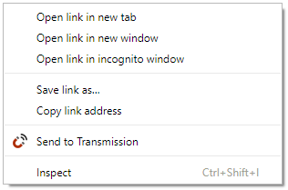
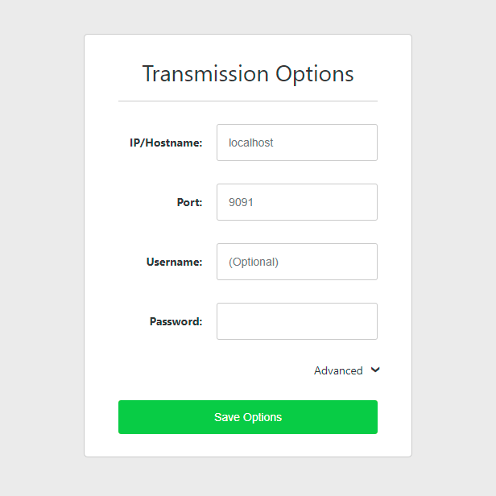

SendToTransmission
===

A lightweight (just 25kB packaged) Chrome extension that adds a context menu item to send the selected link to Transmission.

Built using no frameworks, just JavaScript, CSS & HTML.

Easy Installation
---
1. Install from the [Chrome Web Store](https://chrome.google.com/webstore/detail/send-to-transmission/eofpjahbojddbghdiljnfongjdomhmno) 

Manual Installation
---
1. Download the [latest .crx file](https://github.com/rjpr/SendToTransmission/releases/latest)
2. Go to `chrome://extensions/`
3. Drag the .crx file onto the page

Usage
---
1. Enter your Transmission settings on the options page
2. Right click on a torrent/magent link
3. Select "Send to Transmission"

Licenses
---

See the LICENSE.md file for details.

Magnet icon by Gregor Cresnar from the Noun Project. Modified by me.